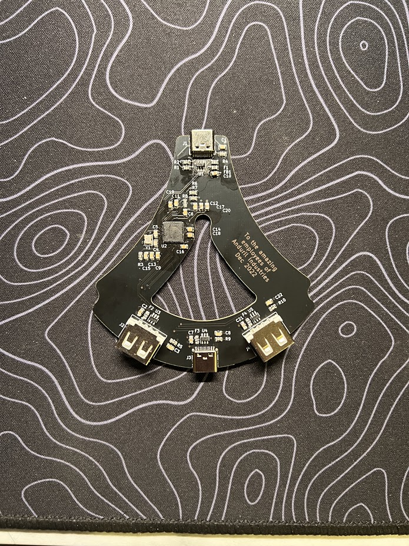
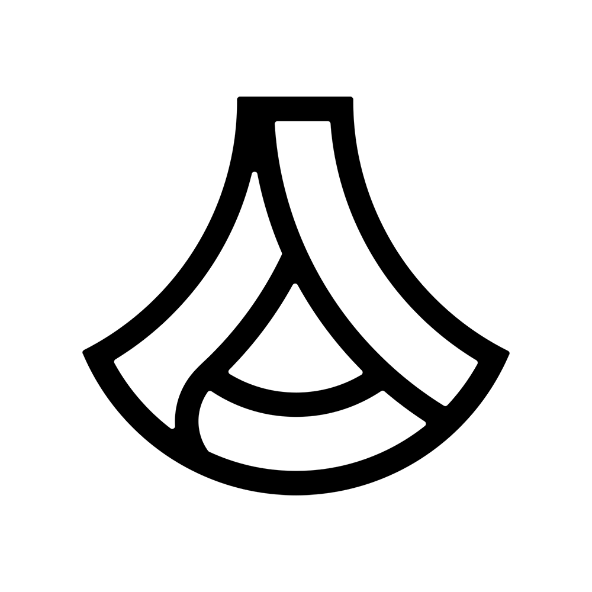
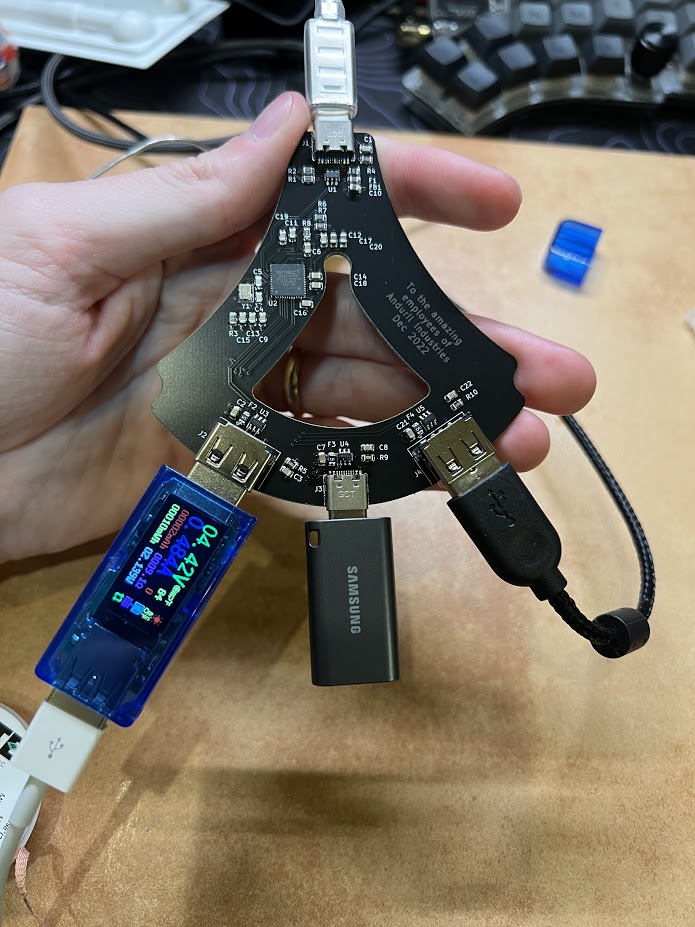

# Anduril USB Hub
This project is a USB 2.0 Hub with USB C input and three output ports (2 USB A, 1 USB C).

  

There isn't much novel about this USB Hub, the main challenge was the layout and packaging to get it to fit in the shape of the [Anduril Industries](https://www.anduril.com/) logo:

The PCB is designed to fit in a 3D printed, two part housing that screws together to make the Anduril Industries logo. The upstream/host of the hub is at the top and the downstream/peripheral ports are at the bottom.

 

## **REQUIREMENTS**:
 - **USB 2.0 minimum**: USB 3.0+ is outside of my skill set currently, so I stuck with USB 2.0 which should be fast enough for most peripherals and data transfer.
 - **A and C ports**: This was trivial but allows the hub to be used for all sorts of devices, including USB C flash drives.
 - **Safety**: Since this is a gift to my coworkers, I wanted the upmost confidence that the devices they plugged in would not get fried by my creation. To ensure this, I added TVS diodes and fuses on every connector for surge protection and over-current protection.
 - **3D printed enclosure**: Since I just got a 3D printer, I wanted to use it to make the housings in the shape of the Anduril logo. This provided me some great practice/challenge in designing PCBs with mechanical constraints. Additionally, this helped me refine a workflow for electro-mechanical integration.

## **WISHLIST**:
### v1.2
- controlled impedence/differential pair routing
- better testing procedure
- downstream UCB C resistors
- fix silkscreen for fuses
### v2.0
- 2 layer for cheaper manufacturing
- controlled impedence/differential pair routing
- better IC selection (USB2514)

## **LICENSE**:
There is **NO** license for reproduction of the Anduril logo. I do not have any rights or permission to reproduce the Anduril logo in any form and am making this at my own risk.

The electronics of Anduril USB Hub by <a xmlns:cc="http://creativecommons.org/ns#" href="https://github.com/colonDdesigns" property="cc:attributionName" rel="cc:attributionURL">colonDdesigns</a> is licensed under a <a rel="license" href="http://creativecommons.org/licenses/by-nc-sa/4.0/">Creative Commons Attribution-NonCommercial-ShareAlike 4.0 International License</a>.

[![CC BY-NC-SA 4.0][cc-by-nc-sa-image]][cc-by-nc-sa]

[cc-by-nc-sa]: http://creativecommons.org/licenses/by-nc-sa/4.0/
[cc-by-nc-sa-image]: https://licensebuttons.net/l/by-nc-sa/4.0/88x31.png
